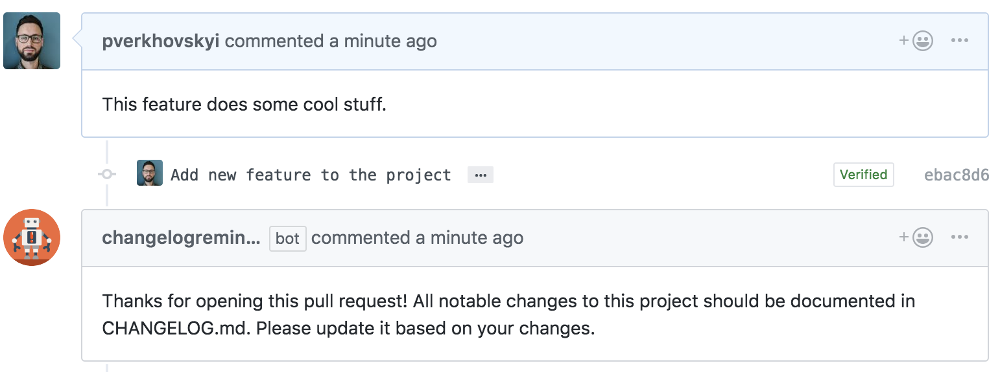

# ChangelogReminder

> A GitHub bot that reminds to update CHANGELOG.md.



## Usage

1. Install the app on the intended repositories. The app has **no access to your code**. It requires following permissions:
  - **Read** access to metadata and single file `.github/config.yml`
  - **Read** and **write** access to pull requests
2. Add a `.github/config.yml` file that contains the contents you would like to reply within an `changelogReminderMessage`.

```yml
# Message to be posted when PRs don't update changelog
changelogReminderMessage: >
    Thanks for opening this pull request! All notable changes to this project should be documented in CHANGELOG.md. Please update it based on your changes.

```

## Contributing

If you have suggestions for how changelog-reminder could be improved, or want to report a bug, open an issue! We'd love all and any contributions.

For more, check out the [Contributing Guide](CONTRIBUTING.md).

## License

[ISC](LICENSE) © 2018 pverkhovskyi <pverkhovskyi@gmail.com>

Built with [probot](https://github.com/probot/probot)
